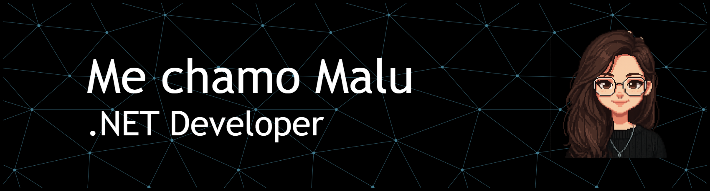

  

## 👩‍💻 Sobre mim
Sou uma desenvolvedora backend em formação, com foco em C# e .NET. Tenho experiência no desenvolvimento de APIs REST utilizando boas práticas de Programação Orientada a Objetos (POO), Entity Framework Core para acesso a dados e organização de código com separação de responsabilidades.

Atualmente, venho aprofundando meus estudos em arquitetura de software, incluindo conceitos de DDD, camadas de aplicação e domínio, além de versionamento com Git. Também possuo experiência no ecossistema Linux e em projetos que envolvem integração entre software e hardware (IoT), além de conhecimentos básicos em frontend com JavaScript, HTML e CSS.

  🚀 <a href="https://maaluu21.github.io/portifolio/" target="_blank">
    Visite meu Portfólio
  </a>

## 🛠️ Tecnologias

  
  
  
  
  
  
  
  
  
  
  
  
  
  
     
  
    

###

## ⭐ GitHub Stats

  
  
  

###

  
  

###
